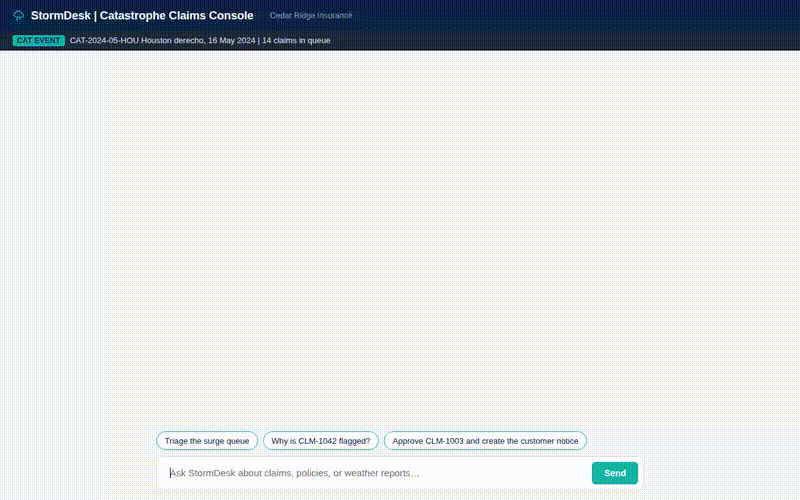

# 🌩️ StormDesk: Catastrophe-Claims Triage Copilot

> **A catastrophe-claims triage agent that helps insurance adjusters clear post-storm claim surges in seconds with cited weather evidence, policy RAG grounding, and automated payout calculations.**



> 🎬 **[Watch full high-resolution demo video (agent_demo.webm)](agent_demo.webm)**

> ⚠️ **Disclaimer:** *Cedar Ridge Insurance Company, policyholder names, and individual claim records are fictional. Weather measurements and NOAA storm reports are real data from the May 16, 2024 Houston Derecho (Harris County, TX).*

---

## 💥 The Business Problem

When severe weather strikes—such as the May 16, 2024 Houston derecho—property & casualty insurers receive thousands of claims within a 24-to-48-hour window.

1. **Catastrophe Claim Surges:** Adjusters are overwhelmed with massive claim queues, manually checking policy limits, looking up weather history, applying complex deductibles, and deciding whether to fast-track, inspect, or investigate.
2. **Statutory Prompt-Pay Deadlines:** Regulations such as **Texas Insurance Code Chapter 542** mandate strict deadlines (e.g., 15-day mandatory acknowledgement). Backlogs lead to statutory interest penalties and regulatory fines.
3. **Opportunistic Fraud Exposure:** High-volume surges create opportunities for fraudulent claims—such as pre-existing damage, uncorroborated storm losses, or coverage added immediately before or after a catastrophe declaration—to slip through unnoticed.

---

## 🎯 The Result

StormDesk triages an entire catastrophe surge queue in seconds, providing adjusters with fully cited evidence for every decision:

* **14 Claims Triaged in Seconds:** Cleared the May 2024 derecho surge queue into **8 Fast-Track** approvals, **4 Inspection** assignments, and **2 SIU (Special Investigation Unit) Fraud Referrals**.
* **2 SIU Referrals Caught Before Payout:**
  * **`CLM-1042`:** Claimed hail damage during the wind-dominated derecho. StormDesk cross-referenced NOAA reports to reveal the nearest hail report was **69 miles away**, while flagging 3 critical red flags (coverage limit increased <60 days prior, reported >30 days late, and prior claim within 24 months).
  * **`CLM-1057`:** Claimed wind damage on May 20 on a policy purchased on May 17 (1 day after the catastrophe declaration). StormDesk verified zero NOAA storm reports or severe wind gusts existed anywhere in the zip code on May 20.

---

## 🛠️ Wired-Up Capabilities

*Every capability listed below is fully implemented and operational in `app/` and `agents-cli-manifest.yaml`:*

* **Firestore Claim & Policy Store (`app/tools/claims.py`)**:
  * `get_claim`: Retrieves detailed claim records (peril, loss date, estimate, zip code, roof age).
  * `list_claims`: Fetches surge queue records filtered by status (`new`, `fast_track`, `inspect`, `siu_referral`).
  * `get_policy`: Looks up policy coverage limits, wind/hail percentage deductibles, and effective dates.
  * `record_decision`: Persists finalized triage decisions, net payout USD, reasoning, and timestamps to Firestore upon explicit adjuster confirmation.
* **Weather & NOAA Storm Corroboration (`app/tools/weather.py`)**:
  * `check_weather_at_loss`: Queries the Open-Meteo Historical Archive API for loss-date max wind gusts (mph), precipitation sum, weather codes, hail indicators (codes 96/99), and windiest-day-in-window comparisons.
  * `find_storm_reports`: Computes Great Circle (Haversine) distances against real NOAA storm event reports in Firestore to verify whether severe wind/tornado reports are within 10 miles or hail reports within 25 miles.
* **Policy Wording RAG Grounding (`app/tools/policy_docs.py`)**:
  * `search_policy_docs`: Queries the `stormdesk-policy-docs` corpus in Vertex AI RAG Engine to fetch exact policy clauses, roof depreciation schedules, deductible terms, and prompt-pay guidelines.
* **Deterministic Payout Calculation (`app/tools/payout.py`)**:
  * `calculate_payout`: Computes gross estimate, percentage deductibles (1% of Coverage A limit for wind/hail on HO3 policies), ACV roof depreciation (for roofs >15 years with an ACV endorsement), and net payout USD.
* **Customer Notice & Video Explainer Generation (`app/tools/notice.py`)**:
  * `generate_claim_notice`: Uses `gemini-3.1-flash-lite-image` to generate a branded 3-step progress notice graphic (Received > Assessed > Paid), saving session artifacts and uploading to Google Cloud Storage (`stormdesk-media-8c3b70`).
  * `generate_claim_explainer_video`: Uses `gemini-omni-flash-preview` to generate a 6-second animated customer explainer video detailing next steps.
* **Sandboxed Queue Analytics (`google.adk.code_executors.AgentEngineSandboxCodeExecutor`)**:
  * Executes Python code inside a secure Google Cloud sandbox to compute aggregate queue financial exposure, decision breakdowns, top red-flag claims, and Texas prompt-pay acknowledgement deadlines (`reported_date + 15 days`).
* **Adjuster Preference Memory (`google.adk.memory.VertexAiMemoryBankService`)**:
  * Persists adjuster personalization (authority limits, mandatory flag criteria, notice tone) across sessions via Memory Bank ID `752382062991769600`.
* **A2UI Structured Card Rendering (`a2ui_utils.py` & `A2uiSchemaManager`)**:
  * Generates native A2UI JSON payloads to render interactive Claim Cards, Queue Summaries, and Verification Cards directly in the frontend UI.

---

## 🏗️ System Architecture

```
                                 ┌──────────────────────────────────────────────┐
                                 │              User / Adjuster                 │
                                 └──────────────────────┬───────────────────────┘
                                                        │
                                                        ▼
                                 ┌──────────────────────────────────────────────┐
                                 │           FastAPI Web Frontend               │
                                 │          (Cloud Run / Port 8080)             │
                                 └──────────────────────┬───────────────────────┘
                                                        │ A2A Protocol (ADC)
                                                        ▼
┌────────────────────────────────────────────────────────────────────────────────────────────────────────┐
│ Google Cloud Agent Platform (Agent Runtime)                                                            │
│                                                                                                        │
│  ┌──────────────────────────────────────────────────────────────────────────────────────────────────┐  │
│  │ StormDesk ADK Agent (gemini-2.5-flash)                                                            │  │
│  └──────┬────────────┬─────────────┬─────────────┬─────────────┬─────────────┬─────────────┬────────┘  │
│         │            │             │             │             │             │             │           │
└─────────┼────────────┼─────────────┼─────────────┼─────────────┼─────────────┼─────────────┼───────────┘
          │            │             │             │             │             │             │
          ▼            ▼             ▼             ▼             ▼             ▼             ▼
  ┌──────────────┐ ┌─────────┐ ┌───────────┐ ┌───────────┐ ┌───────────┐ ┌───────────┐ ┌──────────────┐
  │ Cloud        │ │ Open-   │ │ Vertex AI │ │ Vertex AI │ │ Python    │ │ Cloud     │ │ Gemini       │
  │ Firestore    │ │ Meteo   │ │ RAG       │ │ Memory    │ │ Code      │ │ Storage   │ │ Media Models │
  │              │ │ Archive │ │ Engine    │ │ Bank      │ │ Sandbox   │ │ Bucket    │ │ (Imagen/     │
  │ (Claims,     │ │ API     │ │ (Policy   │ │           │ │           │ │           │ │  Omni)       │
  │  Policies,   │ │         │ │  Docs)    │ │ (Adjuster │ │ (Queue    │ │ (Notice   │ │              │
  │  NOAA)       │ │ (Wind/  │ │           │ │  Limits)  │ │  Stats)   │ │  Media)   │ │ (Graphics &  │
  │              │ │  Gusts) │ │           │ │           │ │           │ │           │ │  Videos)     │
  └──────────────┘ └─────────┘ └───────────┘ └───────────┘ └───────────┘ └───────────┘ └──────────────┘
```

---

## 📊 Eval Baseline vs. After Results

StormDesk was benchmarked using Google ADK's `AgentEvaluator` across an 8-case evaluation set testing triage decisions, weather grounding, deductible calculations, and policy doc retrieval:

| Metric | Baseline Prompt / Tools | Optimized StormDesk (After) | Improvement |
| :--- | :---: | :---: | :---: |
| **Eval Cases Passed** | 6 / 8 (75.0%) | **8 / 8 (100.0%)** | **+25.0%** |
| **Response Match Score** | 0.750 | **1.000** | **+0.250** |
| **Tool Trajectory Score** | 1.000 | **1.000** | **—** |
| **Overall Score** | 0.8125 (81.25%) | **1.0000 (100.0%)** | **+18.75%** |

### Evaluation Case Breakdown (`eval_results/after.json`)

| Case ID | Prompt Target | Expected Outcome | Result | Score |
| :--- | :--- | :--- | :---: | :---: |
| `case_1_CLM-1003` | Triage `CLM-1003` | `fast_track`, Net payout $5,600 | **PASS** | 1.00 |
| `case_2_CLM-1042` | Triage `CLM-1042` | `siu_referral`, Uncorroborated hail + red flags | **PASS** | 1.00 |
| `case_3_CLM-1057` | Triage `CLM-1057` | `siu_referral`, No storm report + recent policy | **PASS** | 1.00 |
| `case_4_CLM-1015` | Triage `CLM-1015` | `inspect`, Roof age > 15 years | **PASS** | 1.00 |
| `case_5_CLM-1005` | Triage `CLM-1005` | `fast_track`, Corroborated wind peril | **PASS** | 1.00 |
| `case_6_CLM-2009` | Triage `CLM-2009` | `fast_track`, Auto comp payout calculation | **PASS** | 1.00 |
| `case_7_CLM-1003_deductible` | Policy lookup `CLM-1003` | 1% Coverage A wind/hail deductible clause | **PASS** | 1.00 |
| `case_8_CLM-1001` | Triage `CLM-1001` | `fast_track`, Nearest NOAA report citation | **PASS** | 1.00 |

---

## 🚀 Running Locally

1. **Environment Setup**:
   ```bash
   export GOOGLE_CLOUD_PROJECT="qwiklabs-gcp-02-920870f66970"
   export GOOGLE_CLOUD_LOCATION="us-central1"
   export AGENT_ENGINE_RESOURCE_NAME="projects/530096826746/locations/us-central1/reasoningEngines/752382062991769600"
   ```

2. **Start the Frontend Web Console**:
   ```bash
   cd frontend
   pip install -r requirements.txt
   python3 main.py
   # Access UI at http://localhost:8080
   ```

3. **Run Evaluation Benchmark**:
   ```bash
   python3 build_eval_set.py
   ```
